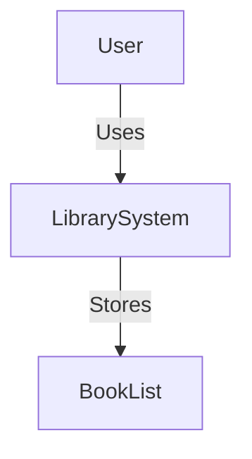

# C4 Architecture: Simple Library System

## 1. Context Diagram
The **Context Diagram** provides an overview of how users interact with the system.

```mermaid
graph TD
  User -->|Uses| LibrarySystem
  LibrarySystem -->|Stores| BookList
```
