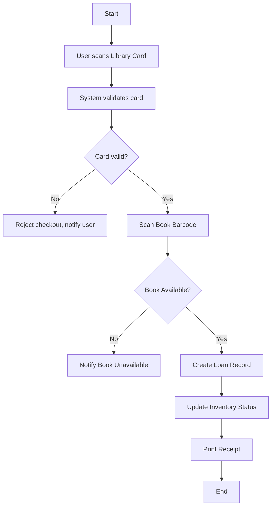

### Book Checkout Workflow

```mermaid
flowchart TD
    A[Start] --> B[User scans Library Card]
    B --> C[System validates card]
    C --> D{Card valid?}
    D -- No --> E[Reject checkout, notify user]
    D -- Yes --> F[Scan Book Barcode]
    F --> G{Book Available?}
    G -- No --> H[Notify Book Unavailable]
    G -- Yes --> I[Create Loan Record]
    I --> J[Update Inventory Status]
    J --> K[Print Receipt]
    K --> L[End]
```
