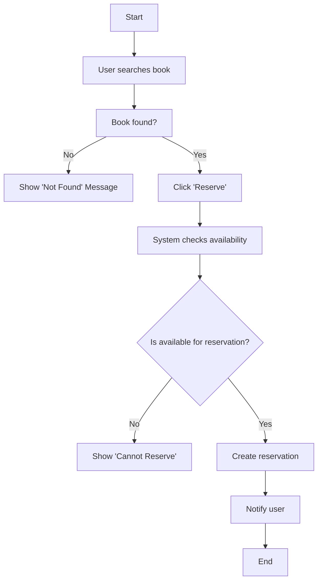

```mermaid
flowchart TD
    A[Start] --> B[User searches book]
    B --> C[Book found?]
    C -- No --> D[Show 'Not Found' Message]
    C -- Yes --> E[Click 'Reserve']
    E --> F[System checks availability]
    F --> G{Is available for reservation?}
    G -- No --> H[Show 'Cannot Reserve']
    G -- Yes --> I[Create reservation]
    I --> J[Notify user]
    J --> K[End]
```