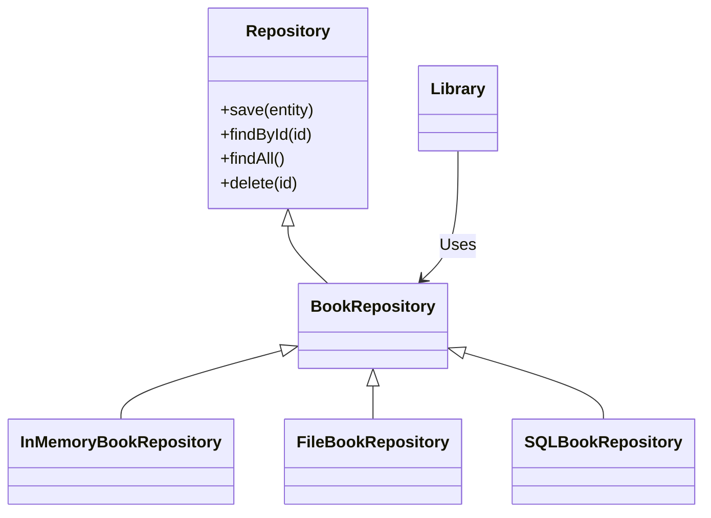

## Repository Layer Architecture Diagram

```mermaid
classDiagram
    class Repository {
        +save(entity)
        +findById(id)
        +findAll()
        +delete(id)
    }
    Repository <|-- BookRepository
    BookRepository <|-- InMemoryBookRepository
    BookRepository <|-- FileBookRepository
    BookRepository <|-- SQLBookRepository
    Library --> BookRepository : Uses
```